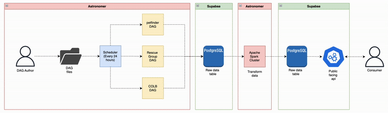

```{r setup, include=FALSE}
# Set the working directory
setwd("/Users/robertosborne/Documents/dev/repos/paw-tech-initiative/apps/pet-adoption-db/docs")

# Load necessary libraries
library(knitr)
```

## Research Question (Finalized)

- Clearly state your refined research question.
- Briefly explain how this question connects to your original project idea.
- Ensure it is answerable given the type of data you plan to collect and within the timeframe of the course.

### Question

What factors in pet adoption listings influence adoption speed and success? The data collected will be used to identify patterns and characteristics that correlate with faster adoption rates, with the hope to help shelters and organizations improve their listing strategies.

## Data Collection Methods (Ingestion Phase)

### Data Sources

- List and describe any updates to the data sources you plan to use (e.g., APIs, open datasets, scraping targets).
- Include URLs, access requirements, and sample data format descriptions (e.g., JSON, CSV).
- Note any ethical, legal, or logistical considerations for data use.

#### APIs
- [Petfinder API](https://www.petfinder.com/developers/)
    - Rate limit: Up to 1,000 requests/day, 50 requests/second.
    - Format: JSON
- [Rescue Groups API](https://test1-api.rescuegroups.org/v5/public/docs)
    - No rate limit specified.
    - Format: JSON
- [City of long beach animal shelter data](https://data.longbeach.gov/explore/dataset/animal-shelter-intakes-and-outcomes/api/?disjunctive.animal_type&disjunctive.primary_color&disjunctive.sex&disjunctive.intake_cond&disjunctive.intake_type&disjunctive.reason&disjunctive.outcome_type&disjunctive.outcome_subtype&disjunctive.intake_is_dead&disjunctive.outcome_is_dead&refine.outcome_type=ADOPTION&q.daterangeslider=intake_date:%5B2024-04+TO+2025-03%5D&sort=outcome_date)
    - No rate limit specified.
    - Format: JSON

#### Datasets
- [Sonoma county intake/outtake data](https://data.sonomacounty.ca.gov/Government/Animal-Shelter-Intake-and-Outcome/924a-vesw/data_preview) (Also has an API)
    - Format: CSV

- [Montgomery County Adoptable pets](https://catalog.data.gov/dataset/adoptable-pets)
    - Format: CSV

### Ingestion Plan

- Describe how you will access and ingest the data.
- Specify tools and technologies you plan to use (e.g., requests, BeautifulSoup, pandas, Apache Airflow, etc.).
- Explain if you plan to automate or schedule ingestion (e.g., cron jobs, workflow tools).
- Describe where the data will be stored initially (e.g., local storage, S3 bucket, database).

My plan is to use Supabase for the Postgres database and Astronomer to host my Apache Airflow DAGs. For the datasets, I will download the CSVs and use a Python script to transform and inject the data into the DB. For the APIs, I will create Apache Airflow DAGs that will run on a schedule to fetch, and insert the data into the raw data table of the DB. The scheduling will be configured in the Airflow DAGs for every 24 hours to keep the data fresh. Once the data is in the raw data table, I plan to use Apache Spark to listen to events in the table. The Spark cluster will transform and store that data into the final tables. Supabase provides an easy-to-use API for the data in the DB, so I will expose the data through that API.

#### Early ingestion diagram

```{r, echo=FALSE}
# Display a GIF

```

## Early Thoughts on Data Model Design and Transformation

If you or your team has already begun planning the data model design and transformation process:

- What might your data model look like?
- What data cleaning or transformation steps do you anticipate?
- Mention any initial blockers or technical risks identified so far.

### Current data model

#### Animals

Stores general information about the animals.

| Column Name | Data Type | Constraints | Description |
| --- | --- | --- | --- |
| `id` | SERIAL | PRIMARY KEY | Unique ID for each animal |
| `platform_animal_id` | VARCHAR(25) | NOT NULL | animal id for the platform it came from |
| `name` | VARCHAR(255) | NOT NULL | Animal’s name |
| `age` | ENUM | NULL | kitten, adult, senior |
| `species` | ENUM | NOT NULL | dog, cat |
| `breed` | VARCHAR(100) | UNIQUE | Breed name (e.g., Rottweiler) |
| `sex` | ENUM | NOT NULL | male/female |
| `size` | ENUM | NULL | small, medium, large |
| `description` | TEXT | NULL | Animal description |
| `adopted` | BOOLEAN | NOT NULL | true, false |
| `organization_id` | VARCHAR(50) | FOREIGN KEY | References `organizations.id` |
| `posting_img_count` | SMALLINT | NULL | The count of the images in the posting |
| `posting_source` | VARCHAR(255) | NOT NULL | The source of the pet posting |

#### Attributes

Stores various attributes of animals.

| Column Name | Data Type | Constraints | Description |
| --- | --- | --- | --- |
| `id` | SERIAL | PRIMARY KEY | Unique ID for each attribute |
| `animal_id` | BIGINT | FOREIGN KEY | References `animals.id` |
| `spayed_neutered` | BOOLEAN | NULL | Whether the pet is sterilized |
| `house_trained` | BOOLEAN | NULL | House trained or not |
| `declawed` | BOOLEAN | NULL | Only relevant for cats |
| `special_needs` | BOOLEAN | NULL | Special needs flag |
| `shots_current` | BOOLEAN | NULL | Whether vaccinations are current |

#### Environment

Stores compatibility of an animal with other pets and children.

| Column Name | Data Type | Constraints | Description |
| --- | --- | --- | --- |
| `id` | SERIAL | PRIMARY KEY | Unique ID for each environment |
| `animal_id` | BIGINT | FOREIGN KEY | References `animals.id` |
| `dogs_ok` | BOOLEAN | NULL | Whether the pet is good with dogs |
| `cats_ok` | BOOLEAN | NULL | Whether the pet is good with cats |
| `kids_ok` | BOOLEAN | NULL | Whether the pet is good with children |

#### Organizations

Stores information about the organizations managing adoptions.

| Column Name | Data Type | Constraints | Description |
| --- | --- | --- | --- |
| `id` | VARCHAR(50) | PRIMARY KEY | Unique organization ID |
| `name` | VARCHAR(255) | NOT NULL | Organization name |
| `city` | VARCHAR(255) | NOT NULL | Operating city |
| `state` | VARCHAR(50) | NOT NULL | Operating state |

### Anticipated Data Transformation

I anticipate there being a lot of data transformations as there are many data sources with there own schemas. I will need to transform the data into a common schema for the database. I will also need to clean the data as there are many fields that are not required and some that are not in the correct format. I will also need to do some data validation to ensure that the data is correct and complete.

### Blockers and Technical Risks

I'm concerned about the Apache spark integration. If the spack cluster doesn't listen to the events in the raw data table, then I will need to find another way to transform the data.
